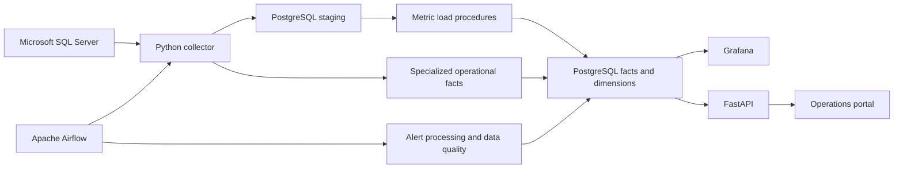

# SQL Server Monitoring Platform

A containerized monitoring stack for collecting Microsoft SQL Server telemetry, storing it in PostgreSQL, scheduling collection and alert workflows with Apache Airflow, and exposing operational views through Grafana and a FastAPI-backed web portal.

> **Deployment scope:** The supplied Docker Compose stack is intended for local development, evaluation, and small controlled deployments. It is not a substitute for production hardening, high availability, capacity planning, secret management, or a reviewed least-privilege access model.

Browse the [documentation index](docs/README.md) for architecture, database,
component, security, deployment, and operations guides.

## What it does

- Collects server and database metrics, backup history, blocking snapshots, deadlocks, query statistics, wait statistics, and SQL Server Agent job outcomes.
- Stores generic metric observations in PostgreSQL staging tables and loads them into dimensional fact tables. Domain-specific observations are persisted to specialized fact tables.
- Schedules collection for enabled targets, checks target availability, evaluates alert rules, and performs routine data-quality checks using Airflow DAGs.
- Provides a provisioned Grafana operations dashboard with instance freshness, active alerts, collection health, metric trends, and operational signals.
- Provides a web operations portal and a versioned REST API for health, target, and alert workflows.

## Architecture and data flow



Airflow's `sqlserver_collection` DAG polls each minute and selects due targets from enabled `config.collection_schedule` rows; a target needs a schedule row to continue collecting after its initial run. The health probe and alert-processing DAGs run every two minutes; the data-quality DAG runs daily at 02:00 UTC. Generic server/database measurements flow through staging and PostgreSQL load procedures. Waits, blocking, query statistics, backups, deadlocks, and SQL Agent records use specialized persistence because their data grains differ.

## Tools and technologies

| Area | Tools used |
|---|---|
| Runtime and orchestration | Docker Engine, Docker Compose v2, GNU Make, Bash |
| Collector and API | Python 3.12 container images; FastAPI, Uvicorn, Pydantic Settings |
| SQL Server connectivity | Microsoft ODBC Driver 18, `pyodbc`, `pymssql` |
| Collection scheduling and ELT | Apache Airflow 2.10.3, Airflow PostgreSQL provider, `croniter` |
| Monitoring repository | PostgreSQL 16, `psycopg` 3 and `psycopg2` |
| Dashboards | Grafana 11.2 with provisioned PostgreSQL data source and dashboard JSON |
| Web portal | Static HTML, CSS, JavaScript, served by NGINX 1.27 Alpine |
| Automated checks | pytest, Python `compileall`, JSON parsing and project validation scripts |

Dockerfiles and component-specific Python dependencies are under [infrastructure](infrastructure/), [app/requirements.txt](app/requirements.txt), [collector/requirements.txt](collector/requirements.txt), and [airflow/requirements.txt](airflow/requirements.txt). The root [requirements.txt](requirements.txt) is for local development and testing. `docker/wheels/` contains prebuilt Python wheels used by selected images for offline package installation; the Airflow image installs its requirements from that wheel directory.

## Screenshots


## Prerequisites

- Linux, macOS, or Windows with WSL2.
- Docker Engine/Desktop with the Compose v2 plugin and enough memory for PostgreSQL, SQL Server, Airflow, Grafana, API, and frontend containers. SQL Server and Airflow are the largest services.
- GNU Make and Bash for the documented `make` workflows. Without Make, invoke the referenced shell scripts or `docker compose` commands directly.
- Git to clone the repository.
- Available local ports: `3000` Grafana, `3001` frontend, `5433` PostgreSQL host mapping, `8000` API, `8080` Airflow, and `1433` SQL Server. Change the corresponding `.env` values if these ports are already in use.

You do **not** need a local Python installation to run the Docker stack. Python 3.12 is used in the app and collector images; the Airflow image is also based on Python 3.12.

## Quick start

```bash
git clone <repository-url>
cd sqlserver_monitoring_platform
make setup
```

`make setup` runs [scripts/bootstrap/setup.sh](scripts/bootstrap/setup.sh). If `.env` does not exist, the script copies [.env.example](.env.example), generates development passwords and the API secret, then builds and starts the Compose stack. Grafana's username defaults to `admin`; the Airflow username is copied from the template placeholder unless you replace it. The script does not overwrite an existing `.env`.

First startup can take several minutes while images are built, PostgreSQL and SQL Server initialize, and Airflow becomes available. Follow progress with:

```bash
make logs
```

Check service state and API readiness:

```bash
docker compose ps
make health
```

The health script checks the Compose service list and the API `/healthz` and `/readyz` endpoints. It does not guarantee that every Airflow DAG has completed a successful collection yet. Allow the SQL Server target to initialize and wait for the first collection runs before expecting metric charts to be populated.

### Local URLs

| Service | URL | Sign-in |
|---|---|---|
| Operations portal | <http://localhost:3001/> | No separate portal login; protected API calls use the configured API key internally. |
| Grafana | <http://localhost:3000/> | Username defaults to `admin`; password is generated into `.env` on fresh setup. |
| Grafana dashboard | <http://localhost:3000/d/sqlserver-platform> | Sign in to Grafana first. |
| Airflow | <http://localhost:8080/> | Use `AIRFLOW_ADMIN_USER` / `AIRFLOW_ADMIN_PASSWORD` from `.env`. The template username is a placeholder; set a real username before first startup if desired. |
| API Swagger UI | <http://localhost:8000/api/v1/docs> | Protected endpoints require the `X-API-Key` header. |
| API ReDoc | <http://localhost:8000/api/v1/redoc> | Protected endpoints require the `X-API-Key` header. |

The main dashboard UID is `sqlserver-platform`; Grafana may append a title-derived URL slug when redirecting.

## Configure SQL Server targets

The default development stack starts a SQL Server 2022 Developer container and seeds a target using the Compose hostname `sqlserver`. Its credentials and connection options are generated/copied into `.env` by the setup script.

To point the default target at an existing SQL Server:

1. Edit `.env` and set `SQLSERVER_HOST`, `SQLSERVER_PORT`, `SQLSERVER_USER`, `SQLSERVER_PASSWORD`, and (if needed) `SQLSERVER_DATABASE`, `SQLSERVER_INSTANCE_NAME`, encryption, and certificate-trust settings.
2. Ensure the host name is reachable **from the Airflow container**, not just from your workstation. On Docker Desktop a host service may be reachable using `host.docker.internal`; Linux users may need a reachable LAN address and appropriate routing/firewall rules.
3. Grant the monitoring login only the SQL Server permissions required by the collector features you enable. Review [SECURITY.md](SECURITY.md) and the [access-control guide](docs/security/access-control.md); do not use `sa` as the collector login.
4. Restart the stack so the changed environment is loaded:

   ```bash
   docker compose up -d --build
   ```

The bootstrap seed initializes the default target when PostgreSQL is initialized. Changing target connection settings in `.env` does not create additional target records. For additional instances, create server, instance, monitoring-target, and collection-schedule records in the appropriate `dimension` and `config` tables; the API currently exposes target listing, lookup, and update endpoints, not target creation.

## Configuration reference

`.env` is local, ignored by Git, and is the primary Compose configuration source. Never commit it. Common settings:

| Variable group | Variables | Purpose |
|---|---|---|
| Application | `ENVIRONMENT`, `APP_NAME`, `APP_SECRET_KEY`, `CORS_ORIGINS`, `DEBUG` | API identity, API-key secret, browser origins, and debug flag. |
| Published ports | `API_PORT`, `FRONTEND_PORT`, `GRAFANA_PORT`, `AIRFLOW_PORT`, `POSTGRES_HOST_PORT`, `SQLSERVER_PORT` | Host-side ports for the services. Container-internal ports remain fixed. |
| PostgreSQL | `POSTGRES_HOST`, `POSTGRES_PORT`, `POSTGRES_DB`, `POSTGRES_USER`, `POSTGRES_PASSWORD`, `POSTGRES_PASSWORD_URLENCODED` | Monitoring database connection and Airflow URL. Inside Compose, use host `postgres` and port `5432`. |
| Grafana and Airflow users | `GRAFANA_ADMIN_USER`, `GRAFANA_ADMIN_PASSWORD`, `AIRFLOW_ADMIN_USER`, `AIRFLOW_ADMIN_PASSWORD` | Web UI administrator credentials. |
| SQL Server | `SQLSERVER_HOST`, `SQLSERVER_PORT`, `SQLSERVER_USER`, `SQLSERVER_PASSWORD`, `SQLSERVER_SA_PASSWORD`, `SQLSERVER_DATABASE`, `SQLSERVER_INSTANCE_NAME`, `SQLSERVER_DRIVER`, `SQLSERVER_ENCRYPT`, `SQLSERVER_TRUST_SERVER_CERTIFICATE`, `SQLSERVER_CONNECTION_TIMEOUT` | Local SQL Server bootstrap and default collector connection. `SQLSERVER_SA_PASSWORD` is for the bundled SQL Server service only. |
| Collector | `TARGET_INSTANCE_KEY`, `COLLECTOR_NAME`, `COLLECTOR_VERSION`, `LOG_LEVEL` | Collector identity and logging settings. |
| Airflow | `AIRFLOW_UID`, `AIRFLOW__CORE__LOAD_EXAMPLES`, `AIRFLOW__CORE__EXECUTOR` | Airflow container settings. The provided stack uses `LocalExecutor`. |

For an existing `.env`, keep `POSTGRES_PASSWORD_URLENCODED` URL-encoded to match `POSTGRES_PASSWORD`; it is used in Airflow's SQLAlchemy connection URL. Do not paste credentials into issue reports, screenshots, or chat.

## Database and data model

The database bootstrap is [scripts/bootstrap/init_database.sh](scripts/bootstrap/init_database.sh). The `database-init` Compose service applies SQL from [db](db/) in dependency order, then seeds metric definitions, dates, alert rules, and the default monitoring target. It is intended to be safe to rerun for idempotent schema/seed setup; review SQL changes before applying them to non-development data.

The primary schemas are:

- `dimension`: servers, SQL Server instances, databases, metrics, and dates.
- `fact`: time-series metric facts and specialized backup, blocking, deadlock, query-stat, SQL Agent, and wait-stat facts.
- `staging`: generic server/database metric ingestion before load procedures process a collection run.
- `monitoring`: collection-run history, collection errors, alert lifecycle, and component health.
- `config`: target, collection schedule, and alert rule configuration.

Definitions, procedures, seeds, and views are grouped under [db](db/). See the [data model](docs/database/data-model.md), [data dictionary](docs/database/data-dictionary.md), and [retention notes](docs/database/retention.md).

If an existing PostgreSQL volume predates current schema or seed changes, rerun the initializer:

```bash
docker compose run --rm database-init
```

This reruns initialization SQL against the existing database; back up first when the database contains data you cannot recreate.

## Airflow workflows

The webserver and scheduler load DAGs from [airflow/dags](airflow/dags/). They connect to PostgreSQL through the `postgres_default` Airflow connection configured by Compose.

| DAG | Schedule | Responsibility |
|---|---|---|
| `sqlserver_collection` | Every minute | Find enabled targets due by interval/cron schedule and run the collector. |
| `sqlserver_monitoring` | Every 2 minutes | Probe active SQL Server targets and update `monitoring.system_health`. |
| `alert_processing` | Every 2 minutes | Process completed collection runs and invoke alert evaluation. |
| `data_quality` | Daily at 02:00 UTC | Purge old staging rows and check integrity/future timestamps. |

Inspect DAG runs, task logs, and failures in the Airflow UI. Collection cadence comes from enabled `config.collection_schedule` rows; `config.monitoring_target` controls target enablement, timeouts, and priority. Do not run a separate collector loop alongside the Airflow scheduler for the same target. See [DAG design](docs/airflow/dag-design.md) and [orchestration](docs/airflow/orchestration.md).

## Grafana dashboard and query library

Grafana provisions the PostgreSQL datasource from [grafana/provisioning/datasources/postgres.yml](grafana/provisioning/datasources/postgres.yml) and the dashboard provider from [grafana/provisioning/dashboards/provider.yml](grafana/provisioning/dashboards/provider.yml). The single editable dashboard is [grafana/dashboards/platform_overview.json](grafana/dashboards/platform_overview.json).

The overview defaults to a 24-hour range and one-minute refresh. Its controls filter instances, databases, and one server metric at a time; single-select avoids comparing measurements with different units. Panels cover instance freshness, platform health issues, active alerts, collection errors/runs, server metrics, stored wait statistics, CPU/memory range averages, backup freshness, SQL Agent failures/history/outcomes, and database/log size trends. Panel descriptions document interpretation limits; for example, wait values must not be treated as rates until the collector's snapshot/delta semantics are verified.

The additional SQL panel catalog is under [grafana/queries](grafana/queries/README.md). These snippets are not separately provisioned dashboards; the overview currently stores panel queries inline in JSON. Read the catalog's interpretation notes before relying on wait-stat or query-delta analyses.

## API and web portal

The API application is in [app](app/), and the static operations portal is in [frontend](frontend/). Interactive API documentation is available at `/api/v1/docs`.

| Endpoint | Authentication | Purpose |
|---|---|---|
| `GET /healthz` | Public | API process liveness. |
| `GET /readyz` | Public | API and PostgreSQL readiness check. |
| `GET /api/v1/targets` | `X-API-Key` | List configured targets. |
| `GET /api/v1/targets/{target_id}` | `X-API-Key` | Retrieve one target. |
| `PATCH /api/v1/targets/{target_id}` | `X-API-Key` | Update supported target fields. |
| `GET /api/v1/alerts/active?limit=100` | `X-API-Key` | List active alerts; `limit` is between 1 and 500. |
| `POST /api/v1/alerts/{alert_event_key}/acknowledge` | `X-API-Key` | Acknowledge an active alert. |

Use `APP_SECRET_KEY` from `.env` as the `X-API-Key` value for protected endpoints. The frontend receives the key through runtime container configuration; do not hard-code it in tracked source. API routes and request schemas are in [app/api/v1/endpoints](app/api/v1/endpoints) and [app/schemas](app/schemas).

## Common commands

Run these from the repository root:

| Command | Effect |
|---|---|
| `make setup` | Generate a local `.env` if needed, build images, and start the stack. |
| `make up` | Build and start services in the background. |
| `make down` | Stop and remove Compose containers/networks; preserve named data volumes. |
| `make restart` | Run `down`, then `up`. |
| `make logs` | Follow logs from all Compose services; press Ctrl+C to stop following. |
| `make health` | List Compose state and call API liveness/readiness endpoints. |
| `make rebuild` | Rebuild images without using build cache. |
| `make test` | Run pytest using the `python3` on PATH. |
| `make lint` | Compile-check `app`, `collector`, and `airflow` Python files. |
| `make validate` | Compile-check Python, parse Grafana dashboard JSON, then run pytest. |
| `make deploy` | Build/start and perform API health checks; requires `.env`. |
| `make backup` | Dump the monitoring PostgreSQL database to a timestamped SQL file under `backups/`. |
| `make cleanup-logs ARGS=14` | Delete Airflow log files older than 14 days (default: 7). |
| `make generate-secret ARGS=32` | Print a URL-safe random secret of the requested byte length. |
| `make generate-fernet-key` | Print a Fernet key for Airflow configuration. |
| `make reset` | **Destructive:** remove Compose containers and named volumes, including PostgreSQL and SQL Server data. |

For direct container commands, `docker compose ps`, `docker compose logs -f <service>`, and `docker compose up -d --build` are useful. Services include `postgres`, `sqlserver`, `api`, `frontend`, `grafana`, `airflow-webserver`, and `airflow-scheduler`.

## Local development and tests

Docker is the supported way to run the complete stack. For editor support, use Python 3.12 where available and create/select a project virtual environment; do not install development packages into the system interpreter. Install root development dependencies with:

```bash
python -m pip install -r requirements.txt
```

Then run:

```bash
make lint
make test
```

The suite includes unit coverage and integration checks for API/collector configuration, SQL Server connections, database schema, Airflow DAG definitions, Grafana provisioning, and the monitoring pipeline. Tests that need external services or Airflow-specific dependencies may require the matching containers/environment. `make validate` combines compile checks, dashboard JSON parsing, and the test suite; it does not start Docker services or prove the live SQL queries return data.

Contribution expectations are in [CONTRIBUTING.md](CONTRIBUTING.md). Keep database contracts synchronized with the collector, Airflow DAGs, API schemas, Grafana SQL, and tests.

## Operations, troubleshooting, and backups

- Service state: `docker compose ps` or `make health`.
- Service logs: `docker compose logs -f <service>` or `make logs`.
- API readiness: `curl -fsS http://localhost:8000/readyz`.
- Collection and alert status: check Airflow DAG/task logs, then inspect the Grafana instance-health and alerts panels.
- PostgreSQL backup: `make backup`; output is written to `backups/` and ignored by Git. Store copies off-host and test restoration regularly.
- Airflow log cleanup: `make cleanup-logs` or pass a retention-day count as `ARGS`.
- If services cannot bind ports, change the corresponding host port in `.env` and recreate the containers.
- If schema changes do not appear in an existing PostgreSQL volume, run the database initializer after taking a backup.

See the [operations runbook](docs/operations/runbook.md), [troubleshooting guide](docs/operations/troubleshooting.md), [Docker deployment guide](docs/deployment/docker.md), and [backup/recovery guide](docs/deployment/backup-recovery.md).

## Security notes

- `.env` credentials generated by `make setup` are for local development. Replace them before any shared or production deployment.
- Never commit secrets, database dumps, or real credentials. Only `.env.example` is intended for version control.
- Use TLS, a secret manager, network restrictions, backups, monitoring of the monitoring stack, and least-privilege service accounts in deployed environments.
- Do not use SQL Server `sa` for collection. Grant only the reviewed DMV, database, and SQL Agent access needed for enabled features.
- `SQLSERVER_TRUST_SERVER_CERTIFICATE=yes` is convenient for the local self-signed development container; use proper certificate validation in production.
- Rotate credentials immediately if exposed. See [SECURITY.md](SECURITY.md) and the [security documentation](docs/security/).

## Repository map

```text
airflow/                 Airflow DAGs and Airflow-specific dependencies
app/                     FastAPI application, API routes, repositories, schemas
collector/               SQL Server collectors, orchestration, PostgreSQL persistence
db/                      PostgreSQL initialization, schema, procedures, seeds, views
docker-compose.yml        Local multi-service stack
docs/                     Architecture, development, deployment, security, operations
frontend/                 Static browser-based operations portal
grafana/                  Dashboard JSON, provisioning, and SQL query catalog
infrastructure/           Container build definitions
scripts/                  Bootstrap, deployment, maintenance, and security helpers
tests/                    Unit, integration, and end-to-end tests
```
