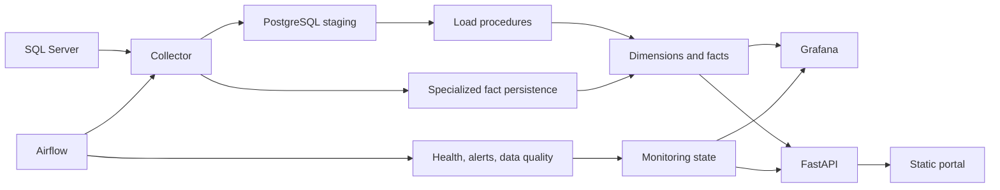

# Architecture Overview

The platform collects SQL Server telemetry into PostgreSQL, coordinates
collection and maintenance through Apache Airflow, and serves operational views
through Grafana and a FastAPI-backed static portal.

The collection DAG polls once per minute. It chooses active targets whose
configured interval or cron schedule is due, then runs a mapped collector task
for each. The collector records each run, synchronizes database dimensions,
collects generic metrics into staging, writes domain-specific observations to
specialized facts, and executes the staging load procedures. Separate DAGs
probe instance connectivity every two minutes, process pending alerts every two
minutes, and run data-quality checks daily.

The Compose stack is designed for local development, evaluation, and controlled
small deployments. See [production readiness](../deployment/production.md)
before exposing it to an untrusted network or relying on it for production
availability.
