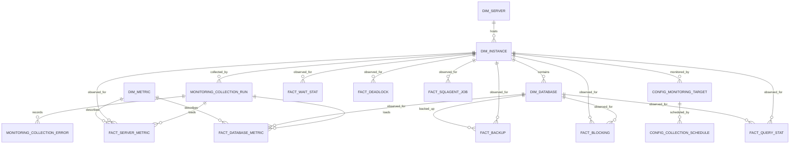

# Data Model

The PostgreSQL warehouse uses dimensions for identity and context, facts for
historical telemetry, staging for generic metric ingestion, and separate
monitoring/configuration schemas for operational state and runtime behavior.

The diagram emphasizes the core relationships. Every fact/staging table and
every foreign key is defined in the SQL files under `db/`; the
[data dictionary](data-dictionary.md) describes the full table contracts.

## Data grains

| Data set | Grain |
|---|---|
| `dimension.dim_server` | One host. |
| `dimension.dim_instance` | One SQL Server instance on a host. |
| `dimension.dim_database` | One database in an instance. |
| `dimension.dim_metric` | One canonical metric code. |
| `dimension.dim_date` | One calendar date, keyed as `YYYYMMDD`. |
| Generic metric facts | One metric, entity, observation time, and collection run. |
| Wait statistics | One wait type, instance, and snapshot time. |
| Query statistics | One captured query-stat row, database, and snapshot time. |
| Blocking | One blocked session observed at a point in time. |
| Backup | One observed backup execution for a database. |
| Deadlock | One distinct deadlock graph per instance. |
| SQL Agent | One job history outcome or step record. |
| `monitoring.collection_run` | One collector pipeline execution per instance. |
| `monitoring.system_health` | One current state row per component. |

## Keys and time

Dimension identity keys are internal surrogate keys. Natural uniqueness is
enforced for host names, instance names within a server, database names/IDs
within an instance, and metric codes. `date_key` is optional in several facts;
`collected_at` or the event-specific timestamp is the precise timestamp.
Collection-run references provide lineage for most facts, while specialized
tables retain their own business/event identifiers.

## Loading behavior

Generic measurements pass through staging so the load procedures can resolve
metric codes and associate rows with the run. Specialized measurements are
written directly to facts. SQL Server databases are synchronized before
database-level facts are persisted. Alert rules and collection schedules are
configuration, not dimensions or facts.
